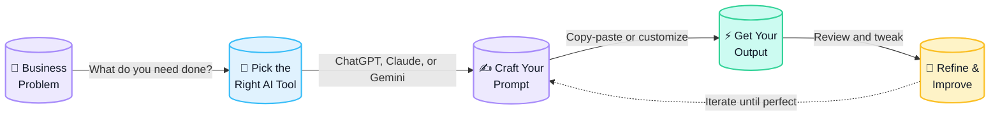

# Apifeny AI — Visual Design Specifications

> Generated: May 31, 2026
> For: Prompt Cards, Workflow Diagrams, Playbook Visual System

---

## 1. Brand Identity (Extracted from live site)

### Color Palette

| Token | Hex | Usage |
|-------|-----|-------|
| **Violet-400** | `#A78BFA` | Primary brand accent, icons, headings |
| **Violet-500** | `#8B5CF6` | Interactive states, links |
| **Cyan-300** | `#67E8F9` | Secondary accent, gradients |
| **Cyan-400** | `#22D3EE` | Hover/active states |
| **Violet→Cyan gradient** | `linear-gradient(135deg, #A78BFA, #67E8F9)` | Icon backgrounds, progress bars, brand mark |
| **Gray-900** | `#111827` | Headings |
| **Gray-500** | `#6B7280` | Body text |
| **Gray-200** | `#E5E7EB` | Borders, dividers |
| **White** | `#FFFFFF` | Card backgrounds, canvas |
| **Amber-400** | `#FBBF24` | Rating stars, badges |
| **Amber-500** | `#F59E0B` | Badge highlight |
| **Emerald-400** | `#34D399` | Asia Score, success states |

### Typography

- **Primary font**: Inter (sans-serif) — already used site-wide
- **Alternate**: SF Pro Display (system font on iOS/macOS)
- **Fallback queue**: `Inter, system-ui, -apple-system, sans-serif`
- **Weights**: 600 (semibold for headings), 500 (medium for subheads), 400 (regular for body)

### Visual Language

- **Cards**: White bg, rounded-xl (`border-radius: 12px`), subtle `border-gray-200`, shadow on hover
- **Gradients**: `from-violet-400 to-cyan-300` as brand signature
- **Noise**: Clean, airy, plenty of white space — no dark gradients
- **Icon style**: Lucide icons, 24px default
- **Mood**: Modern, trustworthy, approachable — not "tech bro dark mode"

---

## 2. Prompt Cards (Alex Prompter / God of Prompt Style)

### Canvas Spec

| Property | Value |
|----------|-------|
| **Canvas size** | **1200 × 1600 px** (4:5 portrait — optimized for Instagram/Pinterest share) |
| **Alternate** | 1200 × 1200 (1:1 — LinkedIn/Twitter) |
| **Export format** | PNG (2x for Retina), also SVG |

### Layout (Top→Bottom, y-coordinates approximate)

```
┌──────────────────────────────────────────────────┐  y=0
│  [small decorative gradient bar, 1200 × 8px]     │  y=0-8
│                                                   │
│  ┌──┐                                            │
│  │ 🦊│  APIFENY PLAYBOOK                         │  y=40
│  └──┘  #12: Content Repurposing                  │
│                                                   │
│  ─── 40px spacing ───                            │
│                                                   │
│  ┌──────────────────────────────────────────────┐ │  y=130
│  │                                              │ │
│  │   📣  EYE-CATCHING HOOK (max 2 lines)        │ │
│  │   "Cut 15 hrs of content work per week"      │ │
│  │                                              │ │
│  └──────────────────────────────────────────────┘ │
│                                                   │
│  ─── 32px spacing ───                            │
│                                                   │
│  [MODEL BADGE]  ┌──────────────┐                 │  y=320
│                 │  ChatGPT ✅  │                 │
│                 │  Claude  ✅  │                 │
│                 └──────────────┘                 │
│                                                   │
│  ─── 40px spacing ───                            │
│                                                   │
│  PROMPT PREVIEW (4-6 lines max)                   │  y=440
│  ┌ ─ ─ ─ ─ ─ ─ ─ ─ ─ ─ ─ ─ ─ ─ ─ ─ ─ ┐        │
│  │  "You are an expert content          │        │
│  │   strategist. Repurpose this blog    │        │
│  │   post into 5 LinkedIn posts..."     │        │
│  └ ─ ─ ─ ─ ─ ─ ─ ─ ─ ─ ─ ─ ─ ─ ─ ─ ─ ┘        │
│                                                   │
│  ─── 48px spacing ───                            │
│                                                   │
│  BENEFITS (2×2 grid or 3 bullet list)             │  y=720
│  •  Save 15 hrs/week                             │
│  •  1-click copy                                  │
│  •  Works with ChatGPT & Claude                   │
│                                                   │
│  ─── auto-fill to bottom ───                     │
│                                                   │
│  ┌──────────────────────────────────────────────┐ │  y=1380
│  │       ✦  DOWNLOAD FULL PLAYBOOK  ✦          │ │
│  │       →  apifeny.ai/playbook-12              │ │
│  └──────────────────────────────────────────────┘ │
│                                                   │
│  [small footer with playbook count + QR]          │  y=1540
│  "Playbook 12 of 71 · Apifeny AI"                 │
│                                                   │
└──────────────────────────────────────────────────┘  y=1600
```

### Typography Sizes (for 1200×1600 canvas)

| Element | Size | Weight | Color |
|---------|------|--------|-------|
| Brand mark (top) | 14px | 600 (semibold) | Violet-500 |
| Hook headline | 36-42px | 700 (bold) | Gray-900 |
| Hook sub (optional) | 20px | 400 (regular) | Gray-500 |
| Model badge text | 13px | 600 | Gray-700 |
| Prompt preview text | 18px | 400 | Gray-700 |
| Quote marks / ` ` ` | 22px | 700 | Violet-400 |
| Benefits text | 18px | 500 | Gray-600 |
| CTA button text | 20px | 700 | White |
| Footer | 12px | 500 | Gray-400 |

### Design Elements & Decoration

1. **Top bar**: 8px tall gradient bar `from-violet-400 to-cyan-300` spanning full width
2. **Brand pill**: Petite rounded pill at top with 🦊 Apifeny logo mark + playbook number
3. **Model badges**: Small pills showing "ChatGPT ✅ · Claude ✅" with green check marks, gray-100 bg
4. **Prompt block**: Dotted border (`border-dashed border-gray-300`), light gray-50 bg, code font (`'JetBrains Mono', 'Fira Code', monospace`)
5. **CTA button**: Solid gradient button `from-violet-500 to-cyan-400`, fully rounded, white text
6. **Optional QR corner**: Bottom-right for scan-to-download (small, 80×80px)

### Scannability Rules

- **3-second rule**: Hook, model badge, and one clear benefit visible above the fold
- **No more than 6 lines of prompt text** in the preview block
- **CTA must be unambiguous** — "Download Full Playbook" or "Get The Prompt"
- **Single focal point** per card (don't show multiple prompts)

### Card Variations

| Type | Hook Area | Content |
|------|-----------|---------|
| **Pain Point Card** | "Still spending 15 hrs on content?" | Benefit: explains time saved |
| **Social Proof Card** | "500+ solopreneurs use this" | Testimonial + prompt snippet |
| **How To Card** | "3 steps to automate your emails" | Steps 1-2-3 as numbered list |
| **Tool Comparison** | "ChatGPT vs Claude for copy" | Side-by-side prompt outputs |

---

## 3. AI 101 Workflow Diagram (Onboarding)

### Purpose
Show small biz owners how AI actually works in language they understand. No technical jargon. No "LLMs" or "fine-tuning."

### Visual Style
- **Medium**: SVG (inline or static) or styled Mermaid.js
- **Tone**: Hand-drawn feel but clean — think D2 diagramming or rounded Excalidraw style
- **Colors**: Apifeny palette (violet → cyan)
- **Size**: Full width of PDF page or 800×500px for web section

### Mermaid Source Code



### SVG Layout (if not Mermaid)

```
┌──────────────────┐     ┌──────────────────┐     ┌──────────────────┐
│  💼 Business     │     │  🔧 Pick AI      │     │  ✍️ Craft Your   │
│  Problem         │ ──▶ │  Tool            │ ──▶ │  Prompt          │
│                  │     │                  │     │                  │
│ "What do I need  │     │ ChatGPT, Claude  │     │ "Act as a copy-  │
│  to accomplish?" │     │ Gemini, Perplex. │     │  writer..."      │
└──────────────────┘     └──────────────────┘     └────────┬─────────┘
                                                           │
                                                           ▼
┌──────────────────┐     ┌──────────────────┐
│  🔄 Refine &     │ ◀── │  ⚡ Get Output   │
│  Improve         │     │                  │
│                  │     │ Copy, review,    │
│ "Tweak prompt,   │     │ use or edit      │
│  run again"      │     │                  │
└──────────────────┘     └──────────────────┘
```

### Accompanying Text (placed below diagram)

**Headline**: "That's it. You just did AI."

**Body**: "Every Apifeny playbook follows this same loop. We did the prompting. You just copy-paste and ship. No degree required."

### Pain Point Addressed (for onboarding section)

| Section | Text |
|---------|------|
| Title | "AI isn't magic. It's a 5-step loop." |
| Subtitle | "If you can copy-paste, you can use AI today." |
| Note | "Prompt engineering is just learning to ask the right question. We wrote them for you." |

---

## 4. Playbook Visual System

### Cover Page Template

```
┌──────────────────────────────────────────────────┐
│  [Full-bleed gradient: from-violet-400/20        │
│   to-cyan-300/10, overlaid on white]             │
│                                                   │
│  🦊  APIFENY PLAYBOOK                           │
│                                                   │
│     ┌──────────────────────────────────┐          │
│     │                                  │          │
│     │    #12                           │          │
│     │                                  │          │
│     │  Content Repurposing            │          │
│     │  Machine                        │          │
│     │                                  │          │
│     │  "Turn one blog post into       │          │
│     │   30 days of content in 45 min" │          │
│     │                                  │          │
│     └──────────────────────────────────┘          │
│                                                   │
│  ┌──────────────────────────────────────────────┐ │
│  │  ✦  1 copy-paste prompt  ✦  3 AI tools       │ │
│  │  ✦  7-day content calendar included          │ │
│  └──────────────────────────────────────────────┘ │
│                                                   │
│  Solopreneur Toolkit · Apifeny AI                 │
│  $9 · 30-day guarantee                           │
│                                                   │
└──────────────────────────────────────────────────┘
```

**Cover specs**:
- **Size**: US Letter (8.5×11in / 2550×3300px @300dpi) — standard PDF
- **Cover gradient**: Subtle violet→cyan tint (10-20% opacity), white base
- **Title**: 48px, Gray-900, bold
- **Subtitle/tagline**: 24px, Gray-500, italic
- **Promise line**: 28px, Gray-700, medium weight, centered
- **Pill badges**: Model badges (ChatGPT, Claude) in pill format
- **Price pill**: Small rounded-rect: "$9" with guarantee text

### Inside Page Layouts

#### Page Layout A: "The Prompt"

```
┌──────────────────────────────────────────────────────┐
│  🦊  Apifeny Playbook #12 — Content Repurposing     │
│  ─────────────────────────────────────────────────   │
│                                                        │
│  ┌─────────────── LEFT (45%) ───────────┐ ┌──────────┤
│  │                                       │ │          │
│  │  WORKFLOW DIAGRAM (simplified)        │ │  THE     │
│  │                                       │ │  PROMPT  │
│  │  [Blog Post] ─▶ [AI Tool] ─▶ [Out]  │ │          │
│  │                                       │ │  Copy    │
│  │  Boxes in violet/teal/amber           │ │  this    │
│  │  Connected with arrows                │ │  into    │
│  │                                       │ │  ChatGPT │
│  │  Steps: 1. Paste blog                 │ │          │
│  │         2. Run prompt                 │ │  ┌────── │
│  │         3. Review outputs             │ │  │ "You  │
│  │                                       │ │  │ are a │
│  └───────────────────────────────────────┘ │  │ conte │
│                                            │  │ strat │
│                                            │  │ ..."  │
│                                            │  └────── │
│                                            │          │
│                                            │  ┌────── │
│                                            │  │ 📋    │
│                                            │  │ Copy  │
│                                            │  └────── │
└────────────────────────────────────────────┴──────────┘
```

**Layout**:
- **Two-column split**: 45% left (workflow), 55% right (the actual prompt)
- **Left**: Simple flowchart showing inputs → tool → output with 3-4 labeled steps
- **Right**: The full prompt in a code block, monospace, with a Copy button styled as pill
- **Footer**: Page number, playbook name, Apifeny logo mark

#### Page Layout B: "How It Works"

```
┌──────────────────────────────────────────────────────┐
│  🦊  How It Works                             p.3/12 │
│  ─────────────────────────────────────────────────   │
│                                                        │
│  ┌──── STEP 1 ────┐  ┌──── STEP 2 ────┐              │
│  │                │  │                │              │
│  │  📥 Paste      │  │  🤖 Run        │              │
│  │  Your Source   │  │  The Prompt    │              │
│  │                │  │                │              │
│  │  "Drop blog    │  │  "Paste into   │              │
│  │   post URL or  │  │   ChatGPT.     │              │
│  │   paste text"  │  │   Wait 15 sec."│              │
│  │                │  │                │              │
│  └────────────────┘  └────────────────┘              │
│                                                        │
│  ┌──── STEP 3 ────┐  ┌──── STEP 4 ────┐              │
│  │                │  │                │              │
│  │  ✏️ Review     │  │  🚀 Schedule   │              │
│  │  & Customize   │  │  & Ship        │              │
│  │                │  │                │              │
│  │  "Tweak tone,  │  │  "Set up in    │              │
│  │   fix headline │  │   Buffer/Hoot. │              │
│  │   add CTA."    │  │   Done."       │              │
│  │                │  │                │              │
│  └────────────────┘  └────────────────┘              │
│                                                        │
│  ⏱️  Total time: ~45 minutes (first time)            │
│  🔁  Recurring: ~15 minutes per batch                 │
└──────────────────────────────────────────────────────┘
```

**How It Works** — 2×2 grid of numbered steps. Each step has:
- **Step number** (1-4) in a small circle with gradient fill
- **Icon** (lucide-based, violet)
- **Title** (Gray-900, 20px bold)
- **Short description** (Gray-500, 14px)
- **Time estimate** per step

#### Page Layout C: "Business Outcome"

```
┌──────────────────────────────────────────────────────┐
│  🦊  Business Outcome                          p.7/12│
│  ─────────────────────────────────────────────────   │
│                                                        │
│  ┌──────────────────────────────────────────────┐     │
│  │                                              │     │
│  │  BEFORE                           AFTER      │     │
│  │  ──────                           ─────      │     │
│  │                                              │     │
│  │  15 hrs/week on content         2 hrs/week   │     │
│  │  $2,200/mo on VA & freelancer  $70/mo on AI │     │
│  │  Inconsistent posting          Daily content │     │
│  │  Low engagement                3x engagement  │     │
│  │                                              │     │
│  └──────────────────────────────────────────────┘     │
│                                                        │
│  📊 ROI Breakdown                                      │
│  ──────────────                                       │
│                                                        │
│  Time saved: 13 hrs/week = 52 hrs/month               │
│  Cost saved: $2,130/mo                                 │
│  Value at your hourly rate: $X/hr × 52 hrs = $Y       │
│                                                        │
│  Testimonial placeholder:                              │
│  "This playbook saved my content workflow."            │
│  ── Marcus L., SaaS Founder, Singapore                │
└──────────────────────────────────────────────────────┘
```

**Business Outcome** — Before/After table or comparison card + ROI calculator. Key number is always highlighted in violet.

#### Page Layout D: "Pro Tips"

```
┌──────────────────────────────────────────────────────┐
│  🦊  Pro Tips                                  p.10/12│
│  ─────────────────────────────────────────────────   │
│                                                        │
│  ┌──────────────────────────────────────────────────┐ │
│  │  💡 PRO TIP #1: Nail Your Input                  │ │
│  │                                                  │ │
│  │  The quality of output depends on your source    │ │
│  │  material. Paste the full blog post, not a link. │ │
│  │  Links get truncated. Full text = better output. │ │
│  │                                                  │ │
│  │  → Add {source_text} to prompt placeholder       │ │
│  └──────────────────────────────────────────────────┘ │
│                                                        │
│  ┌──────────────────────────────────────────────────┐ │
│  │  ⚡ PRO TIP #2: Batch Your Prompts               │ │
│  │                                                  │ │
│  │  Run 5 source posts through at once. ChatGPT     │ │
│  │  handles bulk better than individual requests.   │ │
│  │  Save the output, schedule over the week.        │ │
│  │                                                  │ │
│  │  → Recommended: Monday morning batch session     │ │
│  └──────────────────────────────────────────────────┘ │
│                                                        │
│  ┌──────────────────────────────────────────────────┐ │
│  │  🚨 COMMON MISTAKE: Forgetting the Brand Voice   │ │
│  │                                                  │ │
│  │  The prompt asks for your brand voice. If you    │ │
│  │  skip this, output sounds generic AI. Fill it in.│ │
│  │                                                  │ │
│  │  → Add 1 sentence describing your brand tone     │ │
│  └──────────────────────────────────────────────────┘ │
```

**Pro Tips** — Stacked cards with alternating left gradient bars (violet, cyan, amber). Each card: tip number, icon, title, explanation, actionable takeaway (with `→` arrow).

---

## 5. Page Template Specifications (for PDF generation)

### 50-Page Playbook Structure

| Section | Pages | Layout Template |
|---------|-------|-----------------|
| Cover | 1 | Cover template |
| Table of Contents | 1-2 | Simple list with section icons |
| The 5-Minute AI Setup | 1 | Page Layout B (steps) |
| **The Prompt** | 3-4 | Page Layout A (workflow left, prompt right) |
| How It Works | 2-3 | Page Layout B (2×2 steps) |
| Example Outputs | 2-4 | Screenshots / mock outputs |
| Variations (pro) | 2 | Extended prompts |
| Business Outcome | 1-2 | Page Layout C (before/after) |
| Pro Tips | 2 | Page Layout D (tips cards) |
| Next Steps | 1 | CTA to buy bundle |

### Shared Visual Elements (for every page)

| Element | Spec |
|---------|------|
| **Header** | Playbook # + title, left-aligned, 10px text, Gray-400 |
| **Footer** | Page X of Y + Apifeny logo, 8px text, Gray-300 |
| **Margins** | 60px all sides (for US Letter) |
| **Section dividers** | 1px solid Gray-200 with small brand mark centered |
| **Callout boxes** | Violet left border (4px), bg Gray-50, rounded-r |
| **Code blocks** | bg Gray-50, border Gray-200, rounded, monospace font |
| **Copy button** | Inline pill at top-right of code blocks |
| **Icon set** | Lucide (free, MIT license, consistent weight) |

---

## 6. Tooling Recommendation

### Options Ranked by Speed → Quality

| Method | Time to First Card | Cost | Quality | Scalability | Verdict |
|--------|-------------------|------|---------|-------------|---------|
| **① Canva templates** | 2 hours | $0 (free tier) | ★★★★☆ | Manual per card | **Best for first batch** |
| ② SVG generator (script) | 4 hours | $0 | ★★★☆☆ | Bulk generation | Best for scale |
| ③ aipromptcard.app | 30 min | ~$10/mo | ★★★★☆ | Manual | Good for quick tests |
| ④ Figma + template | 6 hours | $0 | ★★★★★ | Manual per card | Best long-term quality |
| ⑤ HTML/CSS renderer | 8 hours | $0 | ★★★★☆ | Programmatic | Best for web integration |
| ⑥ Python Pillow script | 3 hours | $0 | ★★★☆☆ | Bulk generation | Alternative to SVG |

### Recommended Approach: Hybrid

#### Phase 1 (This week) — Canva + Manual
- **Goal**: Get 3 prompt cards and 1 workflow diagram out the door
- **Tool**: Canva (free)
- **Setup time**: 30 min to duplicate a template, then ~15 min per card
- **Output**: High-fidelity PNGs for social media + PDF covers

#### Phase 2 (Next week) — Programmatic SVG/HTML generation
- **Goal**: Batch-generate all 71 playbook covers + prompt cards
- **Tool**: Custom Node.js script generating SVG + sharp → PNG
- **Setup time**: ~4 hours to code the template engine
- **Benefit**: Update brand colors in one place, regenerate all cards

#### Phase 3 (Stretch) — Web-based card generator
- **Goal**: Let users customize and download cards from the Apifeny site
- **Tool**: HTML Canvas + html2canvas or Puppeteer for server-side render
- **Setup time**: ~8 hours

### Mermaid.js for Workflow Diagrams

- **Recommendation**: YES — use Mermaid for inline web workflows
- **Render option**: Mermaid Live Editor → Export SVG → embed in PDF
- **Style override**: Use the color mapping above (violet/teal/amber fills)
- **Pro tip**: Keep diagram simple (max 5 nodes, no subgraphs for onboarding)

### Summary: Fastest Path to "Good Enough"

```
Week 1 (May 31-Jun 6)
  ├── Day 1: Canva template for prompt cards (1200×1600)  → 3 cards
  ├── Day 2: Mermaid workflow → export SVG                → 1 diagram
  ├── Day 3: Canva playbook cover template                → 3 covers
  ├── Day 4: First playbook PDF (10 pages, manual layout) → 1 playbook
  └── Day 5: Post to social + site + collect feedback

Dependencies needed:
  - Canva account (free)
  - 1 finalized playbook to use as template content
  - Brand assets: Apifeny logo SVG, 🦊 icon
```

---

## 7. Priority Order: What to Build First

| Priority | Asset | Rationale |
|----------|-------|-----------|
| **P0** | 3 Prompt Cards (Instagram format) | Viral social sharing → FOMO → traffic |
| **P0** | AI 101 Workflow Diagram | Onboarding page → reduces friction |
| **P1** | Playbook Cover Template | First playbook needs a professional cover |
| **P1** | Page Template: "The Prompt" | Core page users care about most |
| **P2** | Page Template: "How It Works" | Second most important page |
| **P2** | Page Template: "Business Outcome" | Conversion driver |
| **P3** | Page Template: "Pro Tips" | Delight/differentiator |
| **P3** | All 71 playbook covers (batch) | Site consistency |

### Key Metric Targets

- **Prompt card**: Must be scannable in ≤3 seconds (test with non-designer friend)
- **Workflow diagram**: A 5-year-old should understand the arrows
- **Playbook cover**: Should make users think "I need this" at first glance
- **CTA click-through**: Optimize for "Download Full Playbook" action
- **Shareability**: Cards should work without context (text overlay explains everything)

---

## Appendix: SVG Skeleton for Prompt Card

```html
<svg width="1200" height="1600" xmlns="http://www.w3.org/2000/svg">
  <defs>
    <linearGradient id="brandGrad" x1="0" y1="0" x2="1" y2="1">
      <stop offset="0%" stop-color="#A78BFA"/>
      <stop offset="100%" stop-color="#67E8F9"/>
    </linearGradient>
  </defs>
  
  <!-- Background -->
  <rect width="1200" height="1600" fill="#FFFFFF"/>
  
  <!-- Top brand bar -->
  <rect width="1200" height="8" fill="url(#brandGrad)"/>
  
  <!-- Brand pill -->
  <rect x="60" y="40" width="200" height="32" rx="16" fill="#F5F3FF"/>
  <text x="78" y="60" font-family="Inter, sans-serif" font-size="14" font-weight="600" fill="#8B5CF6">🦊  APIFENY PLAYBOOK</text>
  
  <!-- Hook headline -->
  <text x="60" y="160" font-family="Inter, sans-serif" font-size="40" font-weight="700" fill="#111827">Cut 15 hrs of content work</text>
  <text x="60" y="210" font-family="Inter, sans-serif" font-size="40" font-weight="700" fill="#111827">per week with 1 prompt</text>
  
  <!-- Model badges -->
  <rect x="60" y="280" width="130" height="30" rx="15" fill="#F0FDF4"/>
  <text x="80" y="300" font-family="Inter, sans-serif" font-size="13" font-weight="600" fill="#166534">✓ ChatGPT</text>
  
  <rect x="200" y="280" width="120" height="30" rx="15" fill="#F0FDF4"/>
  <text x="218" y="300" font-family="Inter, sans-serif" font-size="13" font-weight="600" fill="#166534">✓ Claude</text>
  
  <!-- Prompt preview block -->
  <rect x="60" y="360" width="1080" height="200" rx="12" fill="#F9FAFB" stroke="#E5E7EB" stroke-width="1" stroke-dasharray="8,4"/>
  <text x="90" y="400" font-family="'JetBrains Mono', monospace" font-size="16" fill="#6B7280">You are an expert content strategist.</text>
  <text x="90" y="430" font-family="'JetBrains Mono', monospace" font-size="16" fill="#6B7280">Repurpose this blog post into 5 LinkedIn</text>
  <text x="90" y="460" font-family="'JetBrains Mono', monospace" font-size="16" fill="#6B7280">posts, 3 tweets, and 1 newsletter.</text>
  <text x="90" y="490" font-family="'JetBrains Mono', monospace" font-size="16" fill="#8B5CF6">→ Use tone: [brand voice]</text>
  
  <!-- Benefits -->
  <circle cx="80" cy="640" r="6" fill="#A78BFA"/>
  <text x="100" y="647" font-family="Inter, sans-serif" font-size="18" fill="#6B7280">Save 15 hrs every week on content</text>
  
  <circle cx="80" cy="690" r="6" fill="#A78BFA"/>
  <text x="100" y="697" font-family="Inter, sans-serif" font-size="18" fill="#6B7280">1-click copy, paste into any AI chat</text>
  
  <circle cx="80" cy="740" r="6" fill="#A78BFA"/>
  <text x="100" y="747" font-family="Inter, sans-serif" font-size="18" fill="#6B7280">Works with ChatGPT, Claude & Gemini</text>
  
  <!-- CTA Button -->
  <rect x="300" y="1380" width="600" height="64" rx="32" fill="url(#brandGrad)"/>
  <text x="600" y="1420" font-family="Inter, sans-serif" font-size="22" font-weight="700" fill="#FFFFFF" text-anchor="middle">✦  DOWNLOAD FULL PLAYBOOK</text>
  
  <!-- Footer -->
  <text x="600" y="1550" font-family="Inter, sans-serif" font-size="12" fill="#9CA3AF" text-anchor="middle">Playbook 12 of 71 · Apifeny AI</text>
</svg>
```

---

*Design specifications complete. Ready for handoff to Canva template builder or SVG generation script.*
